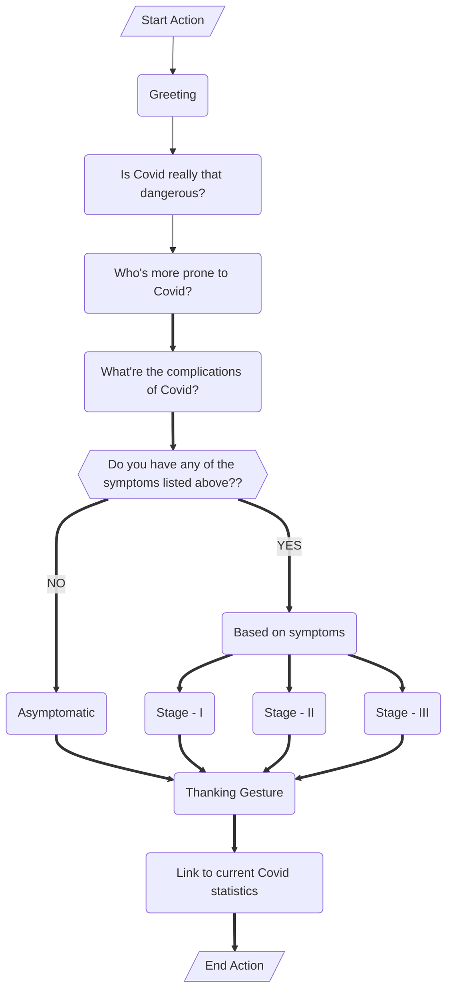

## Assignments 1 - 4 \[All link expires on Nov 12th\]

## - [Assignment - I](https://ferry.s3.jp-tok.cloud-object-storage.appdomain.cloud/index.html)
## - [Assignment - II A](http://159.122.174.143:31837)
## - [Assignment - II B](http://159.122.174.143:32208)
## - [Assignment - II C](http://159.122.174.143:30458)
## - [Assignment - III](https://frustum.s3.jp-tok.cloud-object-storage.appdomain.cloud/index.html)
## - Assignment - IV

1. Pulling image of hello-world.  
[1.gif](Assignment%20-%20IV/1.gif)  

2. Dockerfile for JobPortal application.  

```dockerfile
FROM jobportal:latest
WORKDIR ~/Desktop/
ADD . jobportal/
WORKDIR ~/Desktop/jobportal
RUN pip install -r requirements
RUN chmod +x app.sh
CMD ["/bin/sh","app.sh"]
```

3. Created an IBM container registry and deployed hello-world image in it.  
[3_1.gif](Assignment%20-%20IV/3.1.gif)  
[3_2.gif](Assignment%20-%20IV/3.2.gif)

4. Created a Kubernetes cluster and exposed it using NodePort.
[4.gif](Assignment%20-%20IV/4.gif)  


### Watson Assistant's actions and steps (Assignment III)  

