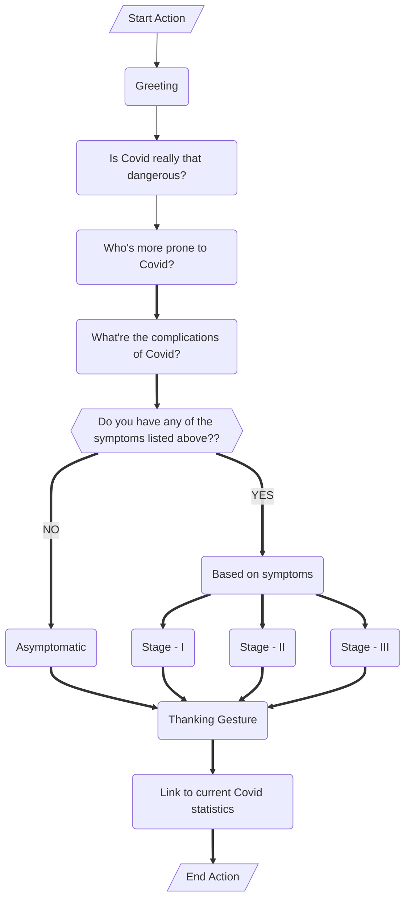

## Assignments 1 - 3 \[All link expires on Nov 12th\]

## - [Assignment - I](https://ferry.s3.jp-tok.cloud-object-storage.appdomain.cloud/index.html)
## - [Assignment - II A](http://159.122.174.143:31837)
## - [Assignment - II B](http://159.122.174.143:32208)
## - [Assignment - II C](http://159.122.174.143:30458)
## - [Assignment - III](https://frustum.s3.jp-tok.cloud-object-storage.appdomain.cloud/index.html)

### Watson Assistant's actions and steps (Assignment III)

#### Flowchart and it's explanation

