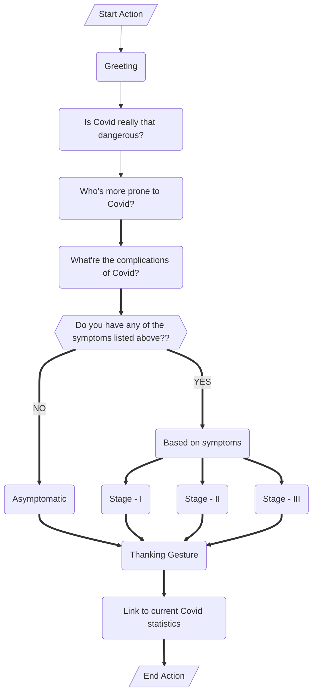

## Assignments 1 - 3 \[All link expires on Nov 12th\]

## - [Assignment - I](https://ferry.s3.jp-tok.cloud-object-storage.appdomain.cloud/index.html)
## - [Assignment - II A](http://159.122.174.143:31837)
## - [Assignment - II B](http://159.122.174.143:32208)
## - [Assignment - II C](http://159.122.174.143:30458)
## - [Assignment - III](https://frustum.s3.jp-tok.cloud-object-storage.appdomain.cloud/index.html)

## Watson Assistant's actions and steps

### Flowchart and it's explanation

### Is Covid really that dangerous?

Covid-19 can be deadly for some people. Older adults and people with existing health conditions are more at risk of serious complications, which can be life threatening.
According to the World Health Organization (WHO), about 80% of people who develop the disease have mild to moderate symptoms and fully recover without needing treatment in a hospital.
Roughly 1 in 5 people experience serious illness. But always, prevention is better than cure.

### Who is more prone to Covid?

Groups at high risk of severe flu include:

- children
- pregnant women
- older adults
- people with weakened immune systems
- people with underlying health conditions

### What're the complications of Covid?

Covid-19 can also cause serious and sometimes fatal complications, including:
- pneumonia
- arrhythmia, which is an irregular heartbeat
- damage to organs
- multiple organ failure
- sepsis
- shock
- respiratory distress syndrome
- heart failure

### *Do you have any of the symptoms listed above??*

#### NO

0. No Symptoms
	- Maybe you're asymptomatic.
	- In a 2021 research review, experts found that the prevalence of asymptomatic Covid-19 among people with a confirmed Covid-19 infection was 40.5 percent.
	- The experts found that studies in Asia reported the lowest percentage of asymptomatic people, possibly due to the city-wide screening programs in China.
	- Children with Covid-19 may be more likely to be asymptomatic than adults, with some studies estimating that as many as half of all children who develop Covid-19 don’t develop symptoms.
	- A 2021 study found that children and young adults have a low chance of developing fever or respiratory symptoms with Covid-19, but people who don’t have these symptoms can still pass the coronavirus to others.
	- In this pandemic, always be cautious and make sure you take effective preventive measures to stay healthy with your family and friends.

#### YES

### *Describe your symptom(s) briefly,*

1. Fever, Sneeze, Loss of Smell , Loss of Taste, Sore throat, Nausea, Muscle pain, vomiting, Headache
	- Stage - I of Covid infection, You're experiencing mild symptoms of Covid.
	- Maintain social distancing and quarantine yourself.
	- Practice proper hygiene.
	- Have a healthy diet & Stay hydrated.
	- Take essential supplements.
	- Alert your doctor for medical support.

2. Cough, Respiratory Disorder, Pneumonia, Suffocation, Wheezing, Uneven respiration, Irregular breathing, Tuberculosis
	- Stage - II of Covid infection, Your lungs is mostly infected.
	- Follow all the necessary precautions,
	- Alert your doctor and inform them about your condition and Get hospitalized effective immediate.
	- Get treated by a Pulmonologist ASAP.
	- Every minute wasted can cost you your lungs.

3. Trouble breathing, Constant pain in chest, Pressure in chest, Bluish lips or face, Confusion, Having a hard time staying awake
	- Stage - III or the Emergency symptoms, you are in a emergency situation.
	- Call a Hospital or a Doctor to seek medical care ASAP.
	- At this rate you're just minutes from having a stroke.
	- Don't waste anytime, because your life depends on it.
	- Seek medical attention before something worse happens.

#### That's it / That's all

4. Thanking gesture

5. Link to current Covid statistics