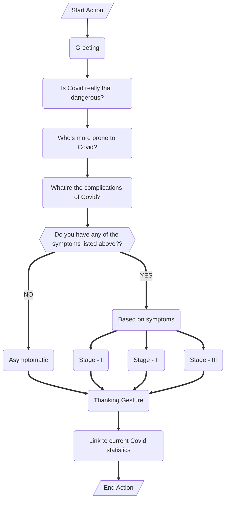

## Assignments 1 - 4 \[All link expires on Nov 12th\]

## - [Assignment - I](https://ferry.s3.jp-tok.cloud-object-storage.appdomain.cloud/index.html)
## - [Assignment - II A](http://159.122.174.143:31837)
## - [Assignment - II B](http://159.122.174.143:32208)
## - [Assignment - II C](http://159.122.174.143:30458)
## - [Assignment - III](https://frustum.s3.jp-tok.cloud-object-storage.appdomain.cloud/index.html)
## - Assignment - IV

1. Pulling image of hello-world.

https://user-images.githubusercontent.com/66721411/197331443-5a038efa-4ce0-4aea-bb66-7713146c43b7.mp4


2. Dockerfile for JobPortal application.  

```dockerfile
FROM jobportal:latest
WORKDIR ~/Desktop/
ADD . jobportal/
WORKDIR ~/Desktop/jobportal
RUN pip install -r requirements
RUN chmod +x app.sh
CMD ["/bin/sh","app.sh"]
```

3. Created an IBM container registry and deployed hello-world image in it.  

https://user-images.githubusercontent.com/66721411/197331559-3837fa59-c8a9-4514-8edd-289c619cd30d.mp4

https://user-images.githubusercontent.com/66721411/197331567-55f77bef-1aa2-453f-84c0-532350598746.mp4

4. Created a Kubernetes cluster and exposed it using NodePort.

https://user-images.githubusercontent.com/66721411/197331579-0851c5e9-b802-481d-af6b-6ca3f02101f3.mp4


### Watson Assistant's actions and steps (Assignment III)  



