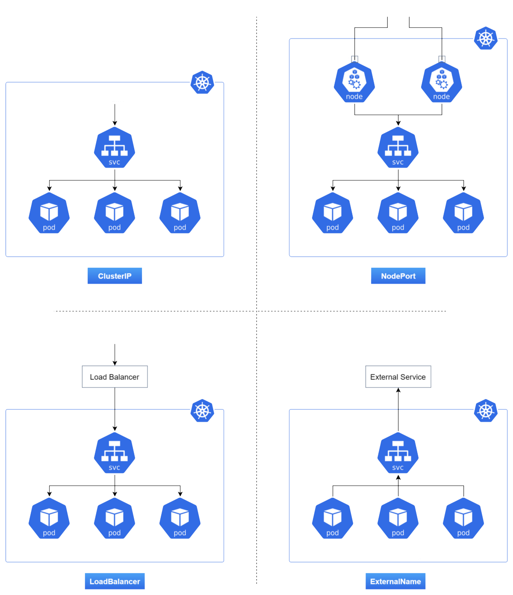

# Personal Expense Tracker Application

### 🚧 Under Construction

- Setting up application environment
  - [X] Linux - Bullseye - 5GB RAM - i5 7th Gen
  - [X] Python 3.10.x
  - [X] Flask
  - [X] IBM Cloud
  - [X] [Docker & Docker-Compose](#docker)
  - [X] [Kubernetes \[Kubectl & Minikube\]](#kubernetes)

- Implementing Web Application

- Integrating SendGrid Service

- Deployment of App in IBM Cloud

## Site Map

```
1. index
2. login
3. dashboard
4. logout
5. pricing
6. customers
```

## Docker

  
Docker is a virtualization environment which is used to run multiple OS embarked inside a single hardware processor. Docker virtualize OS rather than virtualization hardware like in VM/Hypervisor. These dockers are structurally similar to VM/Hypervisor but unlike it, dockers are fast, lightweight, sandbox and easy to deploy. Docker engines uses small functional units called containers which are simply micro-computers, they have their own memory, network & dependencies. These micro-computers can be as powerful as you want it to be. So, How does these stuff work so fast?? and be light-weight?? Here is the catch... These are purely OS based which means, a Linux kernel based docker can only create and use a Linux based container.. they cant support any other OS, but recently an year ago Microsoft came up with WSL as a solution to this problem.

  

- installing docker  

  `apt install docker.io` # Debian
  
  `pacman -Syu docker` # Arch

### Creating and Working with Docker

1. Choose an OS to work with.
2. Download the image of that specific OS using docker.
3. Create a container with the required parameters.

```sh
# Ubuntu has been chosen
docker pull ubuntu # Downloading ubuntu Image
docker run -d -t --name "dockos" ubuntu
# Docker container can be used right after creation or even a while after creation.
# -d => Detach after build
# -t => TTY shell
docker ps #To manage process status docker containers
docker exec -i -t dockos bash # bash is mentioned as the command to execute
# -i => Interactive shell.
docker info dockos #to view all information of a given docker
# To create a mysql server
docker run -i -d --name dockdb -e MYSQL_ROOT_PASSWORD="" mysql
# Setting up a password is necessary for mysql container to work.
```

#### Docker-file Attributes

```
FROM <IMAGE>
ADD <SRC> <DEST>
COPY <SRC> <DEST>
WORKDIR <MNT DIR>
RUN <during BUILD>
CMD <after build, mentioned in square brackets>
ENV <VAR> <VALUE>
```

To save myself from wasting time by fondling with these codes, we wrote a script to fasten things up, which can create and destroy images & containers. Seems like there is a way to create multiple containers simultaneously using [docker-compose](https://docs.docker.com/compose/compose-file/).

## Kubernetes


Kubernetes, also known as K8s, is an open-source system for automating deployment, scaling, and management of containerized applications. Docker and Kubernetes go hand in hand with each other as one of its worker modules. 
Things got a little weird when we couldn't access our deployment or pods from our machine, turns out all these are under private IP address and unlike docker they are not exposed automatically and it should be manually exposed by a Kubernetes service. These Kubernetes services are crucial in deployment as they get to tell the nature of orchestration of pods/deployments and expose applications.

### Hierarchy of Kubernetes

```mermaid
graph TD
Deployment --> Pod --> Node
````

### Types of Kubernetes services

- ClusterIP - Default service for communication between Kube API and clusters.
- LoadBalancer -  This type of service helps us to expose the service by using the cloud provider or to load balance a server with multiple or single replica(s).
- NodePort - This type of service helps us to expose the service through the static port with multiple or single replica(s).
- ExternalName - This type of service helps us to expose or map the service by using a predefined name 'externalName' field.





#### This is our interpretation of using 3 pods with single node in Kubernetes.


According to the above figure, these 3 pods have different IP addresses and their respective open ports.

For example, Network Address = 10.18.7.0 & CIDR = 24

Node A - 10.18.7.1 

Node B - 10.18.7.2

Node C - 10.18.7.3

#### Exposing Kubernetes Applications

Exposing is a crucial part in deploying application to the external network for people to access. There are multiple ways in which we can expose an application.

1. Using a service 
	- NodePort - To expose specific ports of a single or multiple different applications without allocating them multiple IPs.
	- LoadBalancer - To facilitate load balancing between the same application which supposedly get's more traffic than usual.
	- ExternalName - To allocate a custom IP to the application. It's disabled due to security mitigation, but it can be bypassed.
2. Using minikube
	- Minikube is supposedly the master node for kube, so exposing the app works and the external IP address can be obtained by 
		
		`minikube service --all`
		
4. Using master node in IBM CLI (Only works on IBM Cloud Kubernetes)
	- IBM Cloud has it's own master node, which routes the apps to internet.
	
		`kube get node`

- installing minikube

```sh
curl -LO "https://storage.googleapis.com/minikube/releases/latest/minikube_latest_amd64.deb"
```

- installing kubectl

```sh
curl -LO "https://dl.k8s.io/release/$(curl -L -s https://dl.k8s.io/release/stable.txt)/bin/linux/amd64/kubectl"
```

#### Commands

```sh
minikube start --force
minikube docker-env
minikube status
kube cluster-info
kube get|describe|delete node|pods|service|deployment
kube create
kube apply
kube run 
kube expose
kube exec
kube edit
```

#### Kubernetes YAML Syntax(s)

```yaml
# Pod
apiVersion: v1
kind: Pod
metadata:
  name: # Name1
  labels:
    app: # Name2
spec:
  containers:
  - name: # Name of the container
    image: # Name of the image acc. to Docker Hub / Local Docker Image
```

```yaml
# Deployment
apiVersion: apps/v1
kind: Deployment
metadata:
  name: # Name1
spec:
  replicas: # Number of Replicas to scale
  selector:
    matchLabels:
      name: # Name2
  template:
    metadata:
      labels:
        name: # Name3
    spec:
      containers:
      - name: # Name of container
        image: # Name of the image acc. to Docker Hub / Local Docker Image 
        ports:
          - containerPort: # Port to expose
        # imagePullPolicy: Never (optional if using local image)
```

```yaml
# Service
apiVersion: v1
kind: Service
metadata:
  name: # Name1
spec:
  type: NodePort # Can be changed
  ports:
  - port: # Port to expose
    nodePort: # Another port to reroute the exposing port to internet, range is limited to  30000 - 32767
    protocol: TCP # UDP is also supported
  selector:
    app: # Name of the pod/deployment to be exposed
```

#### Constrains when trying to integrate Kubernetes and Docker

  

  

Tab indentation is limited to Kubernetes YAML as it uses YAML 1.1 for conversion.
