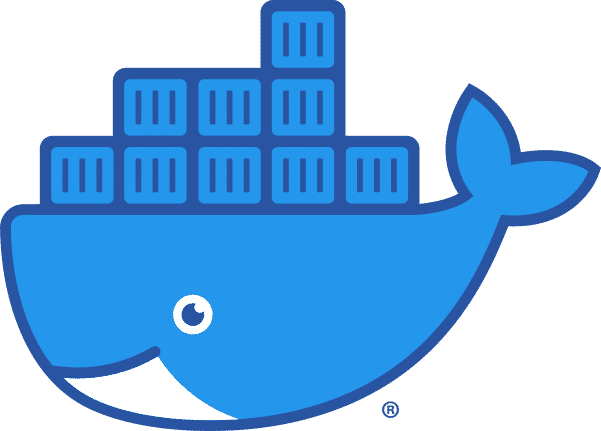
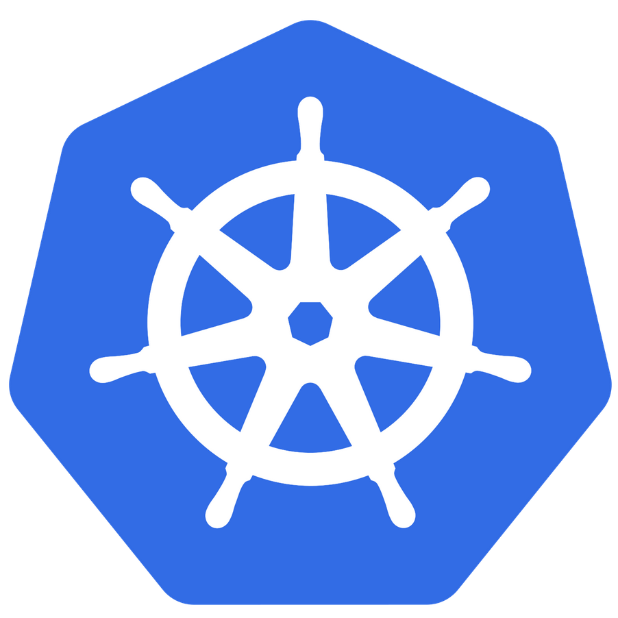
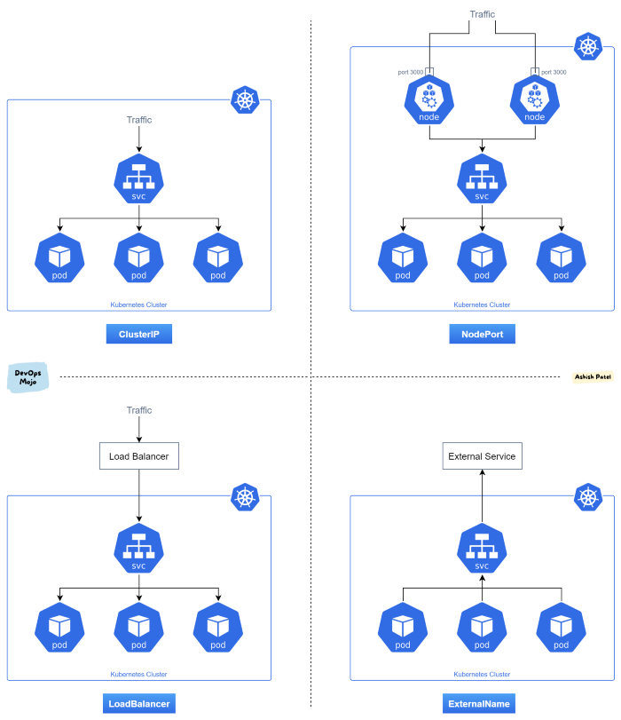
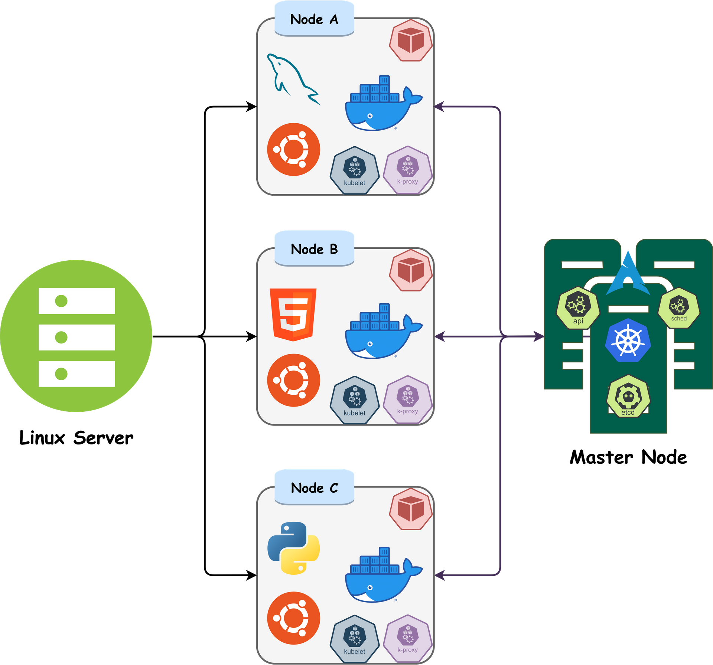
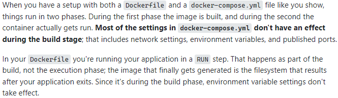
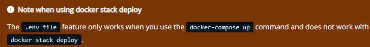

# Personal Expense Tracker Application

- Setting up application environment
  - [x] Linux - Bullseye - 5GB RAM - i5 7th Gen
  - [x] Python 3.10.6
  - [x] Flask
  - [x] Docker & Docker-Compose
  - [x] Kubernetes \[Kubectl & Minikube]

- Implementing Web Application
- Integrating SendGrid Service
- Deployement of App in IBM Cloud

```
Site Map
1. index
2. login
3. dashboard
4. logout
5. pricing
6. customers
```

### Docker

  
Docker is a virtualizing environment which is used to run multiple OS embarked inside a single hardware processor. Docker virutualizes OS rather than virtualizing hardware like in VM/HyperVisor. These dockers are structurually similar to VM/HyperVisor but unlike it, dockers are fast, lightweight, sandbox and easy to deploy. Docker engines uses small functional units called containers which are simply micro-computers, they have their own memory, network & dependencies. These micro-computers can be as powerful as you want it to be. So, How does these stuff work so fast?? and be light-weight?? Here is the catch... These are purely OS based which means, a linux kernel based docker can only create and use a linux based container.. they cant support anyother OS, but recently an year ago Microsoft came up with WSL as a solution to this problem.

  

- installing docker  

	`apt install docker.io`

#### Creating and Working with Docker

1. Choose an OS to work with. (Lets choose CentOS).
2. Download the image of the specific OS using docker.
3. Create a container with the required parameters.

```sh
# Ubuntu has been chosen
docker pull ubuntu # Downloading Image
docker run -d -t --name "dockos" ubuntu
# Docker container can be used right after creation or even a while after creation.
# -d => Detach after creation
# -t => TTY shell.
docker ps #To manage process status docker containers
docker exec -i -t dockos bash # bash is mentioned as the command to execute
# -i => Interactive shell.
docker info dockos #to view all information of a given docker
# To create a mysql server
docker run -i -d --name dockdb -e MYSQL_ROOT_PASSWORD="" mysql
# Setting up a password is necessary for mysql container to work.
```

#### Dockerfile Attributes

```
FROM <IMAGE>
ADD <SRC> <DEST>
COPY <SRC> <DEST>
WORKDIR <MNT DIR>
RUN <during BUILD>
CMD ["sh","ls"]
ENV <VAR> <VALUE>
```

To save myself from wasting time by fondling with these codes, I wrote a script to fasten things up, which can create and destroy images & containers. Seems like there is a way to create multiple containers simultaneously using [docker-compose](https://docs.docker.com/compose/compose-file/).

Voila, docker YAML was a success..., Moving on to Kubernetes -->

### Kubernetes


Kubernetes, also known as K8s, is an open-source system for automating deployment, scaling, and management of containerized applications. Docker and Kubernetes go hand in hand with eachother as one of its worker modules. 
Things got a lil weird when I couldn't access my deployement or pods from my machine, turns out all these are under private IP address and unlike docker they are not exposed automatically and it should be manually exposed by a kubernetes service. These kubernetes services are crucial in deployement as they get to tell the nature of orchestration of pods/deployments and expose applications.

#### Heirarchy of Kubernetes

```mermaid
graph TD
Deployment --> Pod --> Node
````

#### Types of Kubernetes services

- ClusterIP - Default service for communication between Kube API and clusters.
- LoadBalancer -  This type of service helps us to expose the service by using the cloud provider or to load balance a server with multiple or single replica(s).
- NodePort - This type of service helps us to expose the service through the static port with multiple or single replica(s).
- ExtrenalName: This type of service helps us to expose or map the service by using a predefined name ‘externalName’ filed.



#### This is my interpretation of using 3 pods with single node in kubernetes.



According to the above figure the, these 3 pods have different IP addresses and their respective open ports.

For example, Network Address = 10.18.7.0, CIDR = 24
 Node A - 10.18.7.1 
 Node B - 10.18.7.2
 Node C - 10.18.7.3

#### This is my interpretation of using 1 pods with single node in kubernetes.

- installing minikube

```sh
curl -LO "https://storage.googleapis.com/minikube/releases/latest/minikube_latest_amd64.deb"
```

- installing kubectl

```sh
curl -LO "https://dl.k8s.io/release/$(curl -L -s https://dl.k8s.io/release/stable.txt)/bin/linux/amd64/kubectl"
```

#### Commands

```sh
minikube start --force
kube cluster-info
kube get|describe|delete pods|service|deployment
kube create
kube run 
kube expose
kube edit
```

#### Constrains when trying to implement kubernetes with docker

  

  
